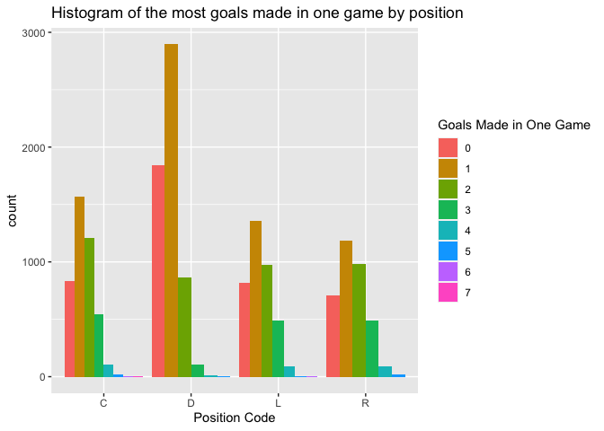

Project 1
================
Dionte Watie
6/17/2021

### NHL API Vignette

Here are the packages that used to throughout the Vignette to allow the
program to properly run correctly and give the correct output.

``` r
library(httr)
library(readr)
library(dplyr)
library(jsonlite)
library(tidyverse)
library(DBI)
library(RSQLite)
library(devtools)
library(bigrquery)
library(rvest)
library(knitr)
library(ggplot2)
```

## Accessing the NHL API

In order to connect R to the NHL API on the internet you have to create
the URL and then call the API to R. the base URL for the NHL API is
**<https://records.nhl.com/site/api>**. The base needs to be at the
beginning of all the API’s that you are calling to R. Next you the link
for the endpoint that you are going to be accessing. For instance, to
call the *franchise* endpoint from the API the link is **/franchise**.
Once you have the link to the endpoint, you paste the base URL and the
endpoint together to get the complete URL such as
**<https://records.nhl.com/site/api/franchise>**. The you need to call
the URL using the GET function. Using the *jsonlite* package, you can
read the API in and convert it to a table. The following are examples of
calling the NHL API.

``` r
franchise <- function(id){
  franUrl <- paste0("https://records.nhl.com/site/api", "/franchise")
  getFran <- GET(franUrl)
  getFran
  franCont <- content(getFran, as = "text")
  franJson <- fromJSON(franCont, flatten = TRUE)
  franJson
  franList <- as_tibble(franJson$data)
  franList
  }
franchise(19171918)
```

    ## No encoding supplied: defaulting to UTF-8.

    ## # A tibble: 39 x 8
    ##       id firstSeasonId fullName            lastSeasonId mostRecentTeamId teamAbbrev teamCommonName teamPlaceName
    ##    <int>         <int> <chr>                      <int>            <int> <chr>      <chr>          <chr>        
    ##  1     1      19171918 Montréal Canadiens            NA                8 MTL        Canadiens      Montréal     
    ##  2     2      19171918 Montreal Wanderers      19171918               41 MWN        Wanderers      Montreal     
    ##  3     3      19171918 St. Louis Eagles        19341935               45 SLE        Eagles         St. Louis    
    ##  4     4      19191920 Hamilton Tigers         19241925               37 HAM        Tigers         Hamilton     
    ##  5     5      19171918 Toronto Maple Leafs           NA               10 TOR        Maple Leafs    Toronto      
    ##  6     6      19241925 Boston Bruins                 NA                6 BOS        Bruins         Boston       
    ##  7     7      19241925 Montreal Maroons        19371938               43 MMR        Maroons        Montreal     
    ##  8     8      19251926 Brooklyn Americans      19411942               51 BRK        Americans      Brooklyn     
    ##  9     9      19251926 Philadelphia Quake…     19301931               39 QUA        Quakers        Philadelphia 
    ## 10    10      19261927 New York Rangers              NA                3 NYR        Rangers        New York     
    ## # … with 29 more rows

``` r
franTeamTot <- function(id){
  TeamUrl <- paste0("https://records.nhl.com/site/api", "/franchise-team-totals")
  getTeam <- GET(TeamUrl)
  getTeam
  TeamCont <- content(getTeam, as = "text")
  TeamJson <- fromJSON(TeamCont, flatten = TRUE)
  TeamJson
  teamList <- as_tibble(TeamJson$data) %>% rename(name = teamName)
  teamList
}


franTeamTot(activeFranchise)
```

    ## No encoding supplied: defaulting to UTF-8.

    ## # A tibble: 105 x 30
    ##       id activeFranchise firstSeasonId franchiseId gameTypeId gamesPlayed goalsAgainst goalsFor homeLosses
    ##    <int>           <int>         <int>       <int>      <int>       <int>        <int>    <int>      <int>
    ##  1     1               1      19821983          23          2        2993         8902     8792        525
    ##  2     2               1      19821983          23          3         257          634      697         53
    ##  3     3               1      19721973          22          2        3788        11907    12045        678
    ##  4     4               1      19721973          22          3         310          899      986         53
    ##  5     5               1      19261927          10          2        6560        20020    20041       1143
    ##  6     6               1      19261927          10          3         518         1447     1404        104
    ##  7     7               1      19671968          16          3         449         1332     1335         97
    ##  8     8               1      19671968          16          2        4171        12255    13690        584
    ##  9     9               1      19671968          17          2        4171        14049    13874        683
    ## 10    10               1      19671968          17          3         391         1131     1190         85
    ## # … with 95 more rows, and 21 more variables: homeOvertimeLosses <int>, homeTies <int>, homeWins <int>,
    ## #   lastSeasonId <int>, losses <int>, overtimeLosses <int>, penaltyMinutes <int>, pointPctg <dbl>,
    ## #   points <int>, roadLosses <int>, roadOvertimeLosses <int>, roadTies <int>, roadWins <int>,
    ## #   shootoutLosses <int>, shootoutWins <int>, shutouts <int>, teamId <int>, name <chr>, ties <int>,
    ## #   triCode <chr>, wins <int>

``` r
seasonRecords <- function(id){
  SeasUrl <- paste0("https://records.nhl.com/site/api", "/franchise-season-records?cayenneExp=franchiseId")
  GetSeas <- GET(SeasUrl)
  GetSeas
  SeasCont <- content(GetSeas, as = "text")
  SeasJson <- fromJSON(SeasCont, flatten = TRUE)
  SeasJson
  Seaslist <- as_tibble(SeasJson$data)
  Seaslist
}
seasonRecords(fewestGoalsAgainst)
```

    ## No encoding supplied: defaulting to UTF-8.

    ## # A tibble: 39 x 57
    ##       id fewestGoals fewestGoalsAgain… fewestGoalsAgainst… fewestGoalsSeasons fewestLosses fewestLossesSeasons  
    ##    <int>       <int>             <int> <chr>               <chr>                     <int> <chr>                
    ##  1     1         174               164 2003-04 (82)        2010-11 (82)                 19 2000-01 (82)         
    ##  2     2         170               190 1975-76 (80)        1972-73 (78)                 15 1978-79 (80)         
    ##  3     3         150               177 1970-71 (78)        1954-55 (70)                 17 1971-72 (78)         
    ##  4     4         173               164 1973-74 (78)        1967-68 (74)                 12 1979-80 (80)         
    ##  5     5         182               188 1997-98 (82)        1969-70 (76)                 21 1992-93 (84), 2016-1…
    ##  6     6         147               172 1952-53 (70)        1955-56 (70)                 13 1971-72 (78)         
    ##  7     7         157               175 1998-99 (82)        2013-14 (82)                 16 1974-75 (80)         
    ##  8     8         155               131 1955-56 (70)        1952-53 (70)                  8 1976-77 (80)         
    ##  9     9         191               179 1998-99 (82)        1995-96 (82), 201…           21 2000-01 (82), 2002-0…
    ## 10    10         147               131 1953-54 (70)        1954-55 (70)                 16 1950-51 (70)         
    ## # … with 29 more rows, and 50 more variables: fewestPoints <int>, fewestPointsSeasons <chr>, fewestTies <int>,
    ## #   fewestTiesSeasons <chr>, fewestWins <int>, fewestWinsSeasons <chr>, franchiseId <int>, franchiseName <chr>,
    ## #   homeLossStreak <int>, homeLossStreakDates <chr>, homePointStreak <int>, homePointStreakDates <chr>,
    ## #   homeWinStreak <int>, homeWinStreakDates <chr>, homeWinlessStreak <int>, homeWinlessStreakDates <chr>,
    ## #   lossStreak <int>, lossStreakDates <chr>, mostGameGoals <int>, mostGameGoalsDates <chr>, mostGoals <int>,
    ## #   mostGoalsAgainst <int>, mostGoalsAgainstSeasons <chr>, mostGoalsSeasons <chr>, mostLosses <int>,
    ## #   mostLossesSeasons <chr>, mostPenaltyMinutes <int>, mostPenaltyMinutesSeasons <chr>, mostPoints <int>,
    ## #   mostPointsSeasons <chr>, mostShutouts <int>, mostShutoutsSeasons <chr>, mostTies <int>,
    ## #   mostTiesSeasons <chr>, mostWins <int>, mostWinsSeasons <chr>, pointStreak <int>, pointStreakDates <chr>,
    ## #   roadLossStreak <int>, roadLossStreakDates <chr>, roadPointStreak <int>, roadPointStreakDates <chr>,
    ## #   roadWinStreak <int>, roadWinStreakDates <chr>, roadWinlessStreak <int>, roadWinlessStreakDates <chr>,
    ## #   winStreak <int>, winStreakDates <chr>, winlessStreak <int>, winlessStreakDates <chr>

``` r
goalieUrl <- paste0("https://records.nhl.com/site/api", "/franchise-goalie-records")
  getGoalie <- GET(goalieUrl)
  getGoalie
```

    ## Response [https://records.nhl.com/site/api/franchise-goalie-records]
    ##   Date: 2021-06-21 23:16
    ##   Status: 200
    ##   Content-Type: application/json
    ##   Size: 698 kB

``` r
  goalieCont <- content(getGoalie, as = "text")
```

    ## No encoding supplied: defaulting to UTF-8.

``` r
  goalieJson <- fromJSON(goalieCont, flatten = TRUE)
  goalieJson
```

    ## $data
    ##     id activePlayer firstName franchiseId        franchiseName gameTypeId gamesPlayed   lastName losses
    ## 1  235        FALSE       Don          15         Dallas Stars          2         315    Beaupre    125
    ## 2  236        FALSE       Bob          28      Arizona Coyotes          2         281    Essensa    114
    ## 3  237        FALSE      Tony          11   Chicago Blackhawks          2         873   Esposito    302
    ## 4  238        FALSE     Grant          25      Edmonton Oilers          2         423       Fuhr    117
    ## 5  239        FALSE       Ron          16  Philadelphia Flyers          2         489    Hextall    172
    ## 6  240        FALSE    Curtis          18      St. Louis Blues          2         280     Joseph     96
    ## 7  241        FALSE      Olie          24  Washington Capitals          2         711     Kolzig    293
    ## 8  242        FALSE      Mike          18      St. Louis Blues          2         347       Liut    133
    ## 9  243        FALSE      Kirk          20    Vancouver Canucks          2         516     McLean    228
    ## 10 244        FALSE    Gilles          13     Cleveland Barons          2         250    Meloche    140
    ## 11 245        FALSE      Greg          18      St. Louis Blues          2         209     Millen     87
    ## 12 246        FALSE      Turk           5  Toronto Maple Leafs          2         629      Broda    222
    ## 13 247        FALSE     Gerry           6        Boston Bruins          2         416   Cheevers    103
    ## 14 248        FALSE      Alec           3     St. Louis Eagles          2         294    Connell    106
    ## 15 249        FALSE      Jake           4      Hamilton Tigers          2          78     Forbes     43
    ## 16 250        FALSE      Bert           2   Montreal Wanderers          2           4    Lindsay      3
    ## 17 251        FALSE    Howard           4      Hamilton Tigers          2           1   Lockhart      1
    ## 18 252        FALSE    Cesare          15         Dallas Stars          2         420    Maniago    190
    ## 19 253        FALSE       Joe           9 Philadelphia Quakers          2          87     Miller     62
    ## 20 254        FALSE     Terry          12    Detroit Red Wings          2         734    Sawchuk    245
    ## 21 255        FALSE      Flat           7     Montreal Maroons          2         107      Walsh     44
    ## 22 256        FALSE       Roy           8   Brooklyn Americans          2         360    Worters    171
    ## 23 257        FALSE       Roy           9 Philadelphia Quakers          2         123    Worters     59
    ## 24 258        FALSE     Daren          31  Tampa Bay Lightning          2         206      Puppa     91
    ## 25 259        FALSE      Bill          25      Edmonton Oilers          2         449    Ranford    193
    ## 26 260        FALSE      Mike          10     New York Rangers          2         666    Richter    258
    ## 27 261        FALSE   Patrick           1   Montréal Canadiens          2         551        Roy    175
    ## 28 262        FALSE   Patrick          27   Colorado Avalanche          2         478        Roy    140
    ## 29 263        FALSE     Billy          22   New York Islanders          2         674      Smith    230
    ## 30 264        FALSE        Ed          18      St. Louis Blues          2         137 Staniowski     68
    ## 31 265        FALSE      Mike          21       Calgary Flames          2         527     Vernon    188
    ## 32 266        FALSE    Martin          23    New Jersey Devils          2        1259    Brodeur    394
    ## 33 267        FALSE     Chris          12    Detroit Red Wings          2         565     Osgood    149
    ## 34 268        FALSE     Marty          15         Dallas Stars          2         509      Turco    154
    ##                                         mostGoalsAgainstDates mostGoalsAgainstOneGame         mostSavesDates
    ## 1                                                  1983-10-07                      10             1987-03-15
    ## 2                                      1992-12-11, 1992-10-12                       8             1989-12-29
    ## 3                                      1983-10-15, 1980-11-26                      10             1977-02-26
    ## 4                                      1984-02-05, 1982-10-12                       9             1986-03-12
    ## 5                                                  1987-04-05                       9             1990-12-23
    ## 6                                      1992-11-25, 1990-02-20                       8             1992-03-02
    ## 7                          2006-01-25, 2005-10-08, 1989-10-21                       8             2000-03-03
    ## 8                                                  1982-02-25                       9 1982-03-18, 1980-11-02
    ## 9                                                  1996-10-19                       9 1997-04-05, 1987-12-17
    ## 10                                                 1973-10-21                      11             1973-01-31
    ## 11                                                 1986-01-06                       9             1988-03-22
    ## 12                                                 1938-01-22                       9                   <NA>
    ## 13 1977-02-12, 1970-01-24, 1966-12-04, 1965-12-15, 1965-12-11                       8             1969-02-06
    ## 14                                                 1925-02-11                      10                   <NA>
    ## 15                                                 1922-12-23                       9                   <NA>
    ## 16                                                 1917-12-22                      11                   <NA>
    ## 17                                                 1921-02-26                      13                   <NA>
    ## 18                                                 1974-11-03                      10             1970-11-01
    ## 19                                                 1929-11-26                       9                   <NA>
    ## 20                                                 1959-03-07                      10             1959-11-14
    ## 21 1933-01-17, 1932-03-19, 1932-02-13, 1932-02-04, 1932-01-14                       6                   <NA>
    ## 22                                                 1932-03-17                      10                   <NA>
    ## 23                                                 1927-03-10                       7                   <NA>
    ## 24                                     1995-10-15, 1993-12-23                       7             1995-11-27
    ## 25 1999-12-30, 1995-12-30, 1995-12-01, 1993-01-23, 1992-11-27                       8             1993-03-17
    ## 26                                                 1993-03-06                      10             1991-01-31
    ## 27                                                 1995-12-02                       9             1991-03-06
    ## 28                                                 1999-11-26                       7             1997-12-10
    ## 29                         1986-04-06, 1972-11-04, 1972-10-29                       9             1972-11-22
    ## 30                                     1980-10-22, 1980-03-09                       9             1980-10-22
    ## 31                                     1993-01-26, 1991-02-23                       8 1989-01-14, 1986-12-20
    ## 32 2014-01-26, 2012-01-04, 2011-11-30, 2009-04-01, 2009-03-07                       6             2010-01-12
    ## 33                         2009-03-07, 2008-11-11, 1997-02-06                       7 2010-12-27, 2000-10-22
    ## 34             2008-10-25, 2007-11-10, 2006-02-12, 2003-11-12                       6             2010-03-08
    ##    mostSavesOneGame  mostShotsAgainstDates mostShotsAgainstOneGame mostShutoutsOneSeason
    ## 1                52             1986-03-21                      55                     1
    ## 2                49             1989-12-29                      50                     5
    ## 3                50             1976-12-12                      53                    15
    ## 4                49             1986-03-12                      54                     4
    ## 5                45             1988-10-13                      50                     5
    ## 6                51             1992-03-02                      54                     2
    ## 7                52             2000-03-03                      54                     6
    ## 8                44             1982-03-18                      48                     3
    ## 9                48             1988-11-17                      52                     5
    ## 10               55             1973-01-31                      58                     4
    ## 11               43 1988-11-03, 1988-03-22                      46                     6
    ## 12               NA                   <NA>                      NA                     9
    ## 13               45             1969-02-06                      48                     4
    ## 14               NA                   <NA>                      NA                    15
    ## 15               NA                   <NA>                      NA                     6
    ## 16               NA                   <NA>                      NA                     0
    ## 17               NA                   <NA>                      NA                     1
    ## 18               54             1970-11-01                      59                     6
    ## 19               NA                   <NA>                      NA                    11
    ## 20               50             1957-11-07                      53                    12
    ## 21               NA                   <NA>                      NA                     2
    ## 22               NA                   <NA>                      NA                    13
    ## 23               NA                   <NA>                      NA                    11
    ## 24               45             1995-10-26                      46                     5
    ## 25               56             1993-03-17                      59                     2
    ## 26               59             1991-01-31                      62                     5
    ## 27               49             1995-02-27                      53                     7
    ## 28               51             1997-12-10                      53                     9
    ## 29               55             1972-11-22                      60                     3
    ## 30               45             1980-10-22                      54                     0
    ## 31               41 1987-11-13, 1986-12-20                      44                     3
    ## 32               51             2010-01-12                      51                    12
    ## 33               46 2010-12-27, 2009-01-12                      49                     6
    ## 34               49             2010-03-08                      52                     9
    ##                                         mostShutoutsSeasonIds mostWinsOneSeason  mostWinsSeasonIds
    ## 1                                19841985, 19851986, 19861987                25           19851986
    ## 2                                                    19911992                33           19921993
    ## 3                                                    19691970                38           19691970
    ## 4                                                    19871988                40           19871988
    ## 5                                                    19961997                37           19861987
    ## 6                                                    19911992                36           19931994
    ## 7                                                    20012002                41           19992000
    ## 8                                                    19831984                33           19801981
    ## 9                                                    19911992                38           19911992
    ## 10                                                   19711972                19           19761977
    ## 11                                                   19881989                22           19881989
    ## 12                                                   19491950                32           19471948
    ## 13                                         19691970, 19791980                30           19761977
    ## 14                                         19251926, 19271928                30           19261927
    ## 15                                                   19241925                19           19241925
    ## 16                                                   19171918                 1           19171918
    ## 17                                                   19201921                 6 19201921, 19211922
    ## 18                                                   19671968                22           19671968
    ## 19                                                   19281929                 9           19281929
    ## 20                               19511952, 19531954, 19541955                44 19501951, 19511952
    ## 21                     19291930, 19301931, 19311932, 19321933                17           19291930
    ## 22                                                   19281929                18           19301931
    ## 23                                                   19271928                19           19271928
    ## 24                                                   19951996                29           19951996
    ## 25                                                   19941995                27 19901991, 19911992
    ## 26                                                   19931994                42           19931994
    ## 27                                                   19931994                36           19911992
    ## 28                                                   20012002                40           20002001
    ## 29                                         19741975, 19751976                32           19811982
    ## 30 19751976, 19761977, 19771978, 19781979, 19791980, 19801981                10 19761977, 19801981
    ## 31                                         19931994, 20002001                39           19871988
    ## 32                                                   20062007                48           20062007
    ## 33                               19961997, 19971998, 19992000                39           19951996
    ## 34                                                   20032004                41           20052006
    ##    overtimeLosses playerId positionCode rookieGamesPlayed rookieShutouts rookieWins seasons shutouts ties wins
    ## 1              NA  8445381            G                44              0         18       9        3   45  126
    ## 2              NA  8446719            G                36              1         18       7       14   32  116
    ## 3              NA  8446720            G                63             15         38      15       74  148  418
    ## 4              NA  8446991            G                48              0         28      10        9   54  226
    ## 5              NA  8447775            G                66              1         37      11       18   58  240
    ## 6              NA  8448382            G                30              0         16       6        5   34  137
    ## 7              23  8448535            G                14              0          2      16       35   63  301
    ## 8              NA  8448865            G                NA             NA         NA       6       10   52  151
    ## 9              NA  8449474            G                41              1         11      11       20   62  211
    ## 10             NA  8449550            G                56              4         16       7        8   48   58
    ## 11             NA  8449627            G                NA             NA         NA       6        9   33   85
    ## 12             NA  8449837            G                45              3         22      14       61  102  304
    ## 13             NA  8449853            G                22              1          5      12       26   76  226
    ## 14             NA  8449856            G                30              7         17       8       64   47  140
    ## 15             NA  8449918            G                NA             NA         NA       3        7    1   34
    ## 16             NA  8450014            G                 4              0          1       1        0    0    1
    ## 17             NA  8450017            G                 1              0          0       3        0    0    0
    ## 18             NA  8450020            G                NA             NA         NA       9       26   70  145
    ## 19             NA  8450043            G                NA             NA         NA       3       11   11   14
    ## 20             NA  8450111            G                70             11         44      14       85  132  350
    ## 21             NA  8450144            G                 1              0          0       7        9   13   46
    ## 22             NA  8450153            G                NA             NA         NA       9       45   70  118
    ## 23             NA  8450153            G                35              7         18       3       22   12   52
    ## 24             NA  8450627            G                NA             NA         NA       7       12   26   77
    ## 25             NA  8450651            G                NA             NA         NA      10        8   54  167
    ## 26             NA  8450833            G                45              0         21      14       24   73  301
    ## 27             NA  8451033            G                47              1         23      12       29   66  289
    ## 28             NA  8451033            G                NA             NA         NA       8       37   65  262
    ## 29             NA  8451525            G                37              0          7      17       22  104  304
    ## 30             NA  8451655            G                29              0         10       6        0   14   37
    ## 31             NA  8452217            G                55              1         30      13       13   57  262
    ## 32             49  8455710            G                47              3         27      21      124  105  688
    ## 33             29  8458568            G                41              2         23      14       39   46  317
    ## 34             37  8460612            G                26              3         13       9       40   26  262
    ##  [ reached 'max' / getOption("max.print") -- omitted 1044 rows ]
    ## 
    ## $total
    ## [1] 1078

``` r
  goalieList <- as_tibble(goalieJson$data)
  goalieList
```

    ## # A tibble: 1,078 x 29
    ##       id activePlayer firstName franchiseId franchiseName       gameTypeId gamesPlayed lastName losses
    ##    <int> <lgl>        <chr>           <int> <chr>                    <int>       <int> <chr>     <int>
    ##  1   235 FALSE        Don                15 Dallas Stars                 2         315 Beaupre     125
    ##  2   236 FALSE        Bob                28 Arizona Coyotes              2         281 Essensa     114
    ##  3   237 FALSE        Tony               11 Chicago Blackhawks           2         873 Esposito    302
    ##  4   238 FALSE        Grant              25 Edmonton Oilers              2         423 Fuhr        117
    ##  5   239 FALSE        Ron                16 Philadelphia Flyers          2         489 Hextall     172
    ##  6   240 FALSE        Curtis             18 St. Louis Blues              2         280 Joseph       96
    ##  7   241 FALSE        Olie               24 Washington Capitals          2         711 Kolzig      293
    ##  8   242 FALSE        Mike               18 St. Louis Blues              2         347 Liut        133
    ##  9   243 FALSE        Kirk               20 Vancouver Canucks            2         516 McLean      228
    ## 10   244 FALSE        Gilles             13 Cleveland Barons             2         250 Meloche     140
    ## # … with 1,068 more rows, and 20 more variables: mostGoalsAgainstDates <chr>, mostGoalsAgainstOneGame <int>,
    ## #   mostSavesDates <chr>, mostSavesOneGame <int>, mostShotsAgainstDates <chr>, mostShotsAgainstOneGame <int>,
    ## #   mostShutoutsOneSeason <int>, mostShutoutsSeasonIds <chr>, mostWinsOneSeason <int>, mostWinsSeasonIds <chr>,
    ## #   overtimeLosses <int>, playerId <int>, positionCode <chr>, rookieGamesPlayed <int>, rookieShutouts <int>,
    ## #   rookieWins <int>, seasons <int>, shutouts <int>, ties <int>, wins <int>

``` r
skateRec <- function(id){
  skateUrl <- paste0("https://records.nhl.com/site/api", "/franchise-skater-records?cayenneExp=franchiseId")
  getSkate <- GET(skateUrl)
  getSkate
  skateCont <- content(getSkate, as = "text")
  skateJson <- fromJSON(skateCont, flatten = TRUE)
  skateJson
  skateList <- as_tibble(skateJson$data, nrow(10), ncol(30))
  skateList
  }
skateRec(417)
```

    ## No encoding supplied: defaulting to UTF-8.

    ## # A tibble: 17,209 x 31
    ##       id activePlayer assists firstName franchiseId franchiseName        gameTypeId gamesPlayed goals lastName 
    ##    <int> <lgl>          <int> <chr>           <int> <chr>                     <int>       <int> <int> <chr>    
    ##  1 16888 FALSE            417 George              5 Toronto Maple Leafs           2        1188   296 Armstrong
    ##  2 16889 FALSE              0 Billy               2 Montreal Wanderers            2           2     1 Bell     
    ##  3 16890 FALSE            794 Johnny              6 Boston Bruins                 2        1436   545 Bucyk    
    ##  4 16891 FALSE            712 Jean                1 Montréal Canadiens            2        1125   507 Beliveau 
    ##  5 16892 FALSE           1111 Ray                 6 Boston Bruins                 2        1518   395 Bourque  
    ##  6 16893 FALSE             33 Harold              9 Philadelphia Quakers          2         216    60 Darragh  
    ##  7 16894 FALSE             13 Herb                9 Philadelphia Quakers          2         216    24 Drury    
    ##  8 16895 FALSE            852 Bobby              16 Philadelphia Flyers           2        1144   358 Clarke   
    ##  9 16896 FALSE            142 Ken                23 New Jersey Devils             2        1283    36 Daneyko  
    ## 10 16897 FALSE              0 Gerry               2 Montreal Wanderers            2           4     0 Geran    
    ## # … with 17,199 more rows, and 21 more variables: mostAssistsGameDates <chr>, mostAssistsOneGame <int>,
    ## #   mostAssistsOneSeason <int>, mostAssistsSeasonIds <chr>, mostGoalsGameDates <chr>, mostGoalsOneGame <int>,
    ## #   mostGoalsOneSeason <int>, mostGoalsSeasonIds <chr>, mostPenaltyMinutesOneSeason <int>,
    ## #   mostPenaltyMinutesSeasonIds <chr>, mostPointsGameDates <chr>, mostPointsOneGame <int>,
    ## #   mostPointsOneSeason <int>, mostPointsSeasonIds <chr>, penaltyMinutes <int>, playerId <int>, points <int>,
    ## #   positionCode <chr>, rookieGamesPlayed <int>, rookiePoints <int>, seasons <int>

``` r
FranDetails <- function(id){
  Fran_url <- paste0("https://records.nhl.com/site/api", "/franchise-detail?cayenneExp=mostRecentTeamId")
  GetDetails <- GET(Fran_url)
  GetDetails
  ContentDetails <- content(GetDetails, as = "text")
  JsonDetails <- fromJSON(ContentDetails, flatten = TRUE)
  JsonDetails
  DetailsList <- as_tibble(JsonDetails$data) 
  DetailsList
  }
FranDetails(captainHistory)
```

    ## No encoding supplied: defaulting to UTF-8.

    ## # A tibble: 39 x 13
    ##       id active captainHistory    coachingHistory    dateAwarded  directoryUrl  firstSeasonId generalManagerHis…
    ##    <int> <lgl>  <chr>             <chr>              <chr>        <chr>                 <int> <chr>             
    ##  1     1 TRUE   "<ul class=\"str… "<ul class=\"stri… 1917-11-26T… https://www.…      19171918 "<ul class=\"stri…
    ##  2     2 FALSE   <NA>              <NA>              1917-11-26T… <NA>               19171918  <NA>             
    ##  3     3 FALSE   <NA>              <NA>              1917-11-26T… <NA>               19171918  <NA>             
    ##  4     4 FALSE   <NA>              <NA>              1917-11-26T… <NA>               19191920  <NA>             
    ##  5     5 TRUE   "<ul class=\"str… "<ul class=\"stri… 1917-11-26T… https://www.…      19171918 "<ul class=\"stri…
    ##  6     6 TRUE   "<ul class=\"str… "<ul class=\"stri… 1924-11-01T… https://www.…      19241925 "<ul class=\"stri…
    ##  7     7 FALSE   <NA>              <NA>              1924-11-01T… <NA>               19241925  <NA>             
    ##  8     8 FALSE   <NA>              <NA>              1925-09-22T… <NA>               19251926  <NA>             
    ##  9     9 FALSE   <NA>              <NA>              1925-11-07T… <NA>               19251926  <NA>             
    ## 10    10 TRUE   "<ul class=\"str… "<ul class=\"stri… 1926-05-15T… https://www.…      19261927 "<ul class=\"stri…
    ## # … with 29 more rows, and 5 more variables: heroImageUrl <chr>, mostRecentTeamId <int>,
    ## #   retiredNumbersSummary <chr>, teamAbbrev <chr>, teamFullName <chr>

``` r
Modifier <- function(x){
  ModUrl <- paste0("https://statsapi.web.nhl.com/api/v1", "/teams?expand=team.stats")
  GetMod <- GET(ModUrl)
  GetMod
  ModCont <- content(GetMod, as = "text", encoding = "UTF-8")
  ModJson <- fromJSON(ModCont, flatten = TRUE)
  ModJson
  ModList <- as_tibble(ModJson$teams)
  ModList
  }
```

The wrapper function is used to be an easier way to call a previous
created functions so that the user has an easier time using the
functions.

``` r
nhlfranchise <- function(franchise){
    franchise(id)
}
nhlfranchise(1)
```

    ## No encoding supplied: defaulting to UTF-8.

    ## # A tibble: 39 x 8
    ##       id firstSeasonId fullName            lastSeasonId mostRecentTeamId teamAbbrev teamCommonName teamPlaceName
    ##    <int>         <int> <chr>                      <int>            <int> <chr>      <chr>          <chr>        
    ##  1     1      19171918 Montréal Canadiens            NA                8 MTL        Canadiens      Montréal     
    ##  2     2      19171918 Montreal Wanderers      19171918               41 MWN        Wanderers      Montreal     
    ##  3     3      19171918 St. Louis Eagles        19341935               45 SLE        Eagles         St. Louis    
    ##  4     4      19191920 Hamilton Tigers         19241925               37 HAM        Tigers         Hamilton     
    ##  5     5      19171918 Toronto Maple Leafs           NA               10 TOR        Maple Leafs    Toronto      
    ##  6     6      19241925 Boston Bruins                 NA                6 BOS        Bruins         Boston       
    ##  7     7      19241925 Montreal Maroons        19371938               43 MMR        Maroons        Montreal     
    ##  8     8      19251926 Brooklyn Americans      19411942               51 BRK        Americans      Brooklyn     
    ##  9     9      19251926 Philadelphia Quake…     19301931               39 QUA        Quakers        Philadelphia 
    ## 10    10      19261927 New York Rangers              NA                3 NYR        Rangers        New York     
    ## # … with 29 more rows

``` r
nhlSeason <- function(seasonRecords){
    seasonRecords(id)
}
nhlSeason(4)
```

    ## No encoding supplied: defaulting to UTF-8.

    ## # A tibble: 39 x 57
    ##       id fewestGoals fewestGoalsAgain… fewestGoalsAgainst… fewestGoalsSeasons fewestLosses fewestLossesSeasons  
    ##    <int>       <int>             <int> <chr>               <chr>                     <int> <chr>                
    ##  1     1         174               164 2003-04 (82)        2010-11 (82)                 19 2000-01 (82)         
    ##  2     2         170               190 1975-76 (80)        1972-73 (78)                 15 1978-79 (80)         
    ##  3     3         150               177 1970-71 (78)        1954-55 (70)                 17 1971-72 (78)         
    ##  4     4         173               164 1973-74 (78)        1967-68 (74)                 12 1979-80 (80)         
    ##  5     5         182               188 1997-98 (82)        1969-70 (76)                 21 1992-93 (84), 2016-1…
    ##  6     6         147               172 1952-53 (70)        1955-56 (70)                 13 1971-72 (78)         
    ##  7     7         157               175 1998-99 (82)        2013-14 (82)                 16 1974-75 (80)         
    ##  8     8         155               131 1955-56 (70)        1952-53 (70)                  8 1976-77 (80)         
    ##  9     9         191               179 1998-99 (82)        1995-96 (82), 201…           21 2000-01 (82), 2002-0…
    ## 10    10         147               131 1953-54 (70)        1954-55 (70)                 16 1950-51 (70)         
    ## # … with 29 more rows, and 50 more variables: fewestPoints <int>, fewestPointsSeasons <chr>, fewestTies <int>,
    ## #   fewestTiesSeasons <chr>, fewestWins <int>, fewestWinsSeasons <chr>, franchiseId <int>, franchiseName <chr>,
    ## #   homeLossStreak <int>, homeLossStreakDates <chr>, homePointStreak <int>, homePointStreakDates <chr>,
    ## #   homeWinStreak <int>, homeWinStreakDates <chr>, homeWinlessStreak <int>, homeWinlessStreakDates <chr>,
    ## #   lossStreak <int>, lossStreakDates <chr>, mostGameGoals <int>, mostGameGoalsDates <chr>, mostGoals <int>,
    ## #   mostGoalsAgainst <int>, mostGoalsAgainstSeasons <chr>, mostGoalsSeasons <chr>, mostLosses <int>,
    ## #   mostLossesSeasons <chr>, mostPenaltyMinutes <int>, mostPenaltyMinutesSeasons <chr>, mostPoints <int>,
    ## #   mostPointsSeasons <chr>, mostShutouts <int>, mostShutoutsSeasons <chr>, mostTies <int>,
    ## #   mostTiesSeasons <chr>, mostWins <int>, mostWinsSeasons <chr>, pointStreak <int>, pointStreakDates <chr>,
    ## #   roadLossStreak <int>, roadLossStreakDates <chr>, roadPointStreak <int>, roadPointStreakDates <chr>,
    ## #   roadWinStreak <int>, roadWinStreakDates <chr>, roadWinlessStreak <int>, roadWinlessStreakDates <chr>,
    ## #   winStreak <int>, winStreakDates <chr>, winlessStreak <int>, winlessStreakDates <chr>

``` r
nhlTeamTot <- function(franTeamTot){
    franTeamTot(id)
}
nhlTeamTot(1)
```

    ## No encoding supplied: defaulting to UTF-8.

    ## # A tibble: 105 x 30
    ##       id activeFranchise firstSeasonId franchiseId gameTypeId gamesPlayed goalsAgainst goalsFor homeLosses
    ##    <int>           <int>         <int>       <int>      <int>       <int>        <int>    <int>      <int>
    ##  1     1               1      19821983          23          2        2993         8902     8792        525
    ##  2     2               1      19821983          23          3         257          634      697         53
    ##  3     3               1      19721973          22          2        3788        11907    12045        678
    ##  4     4               1      19721973          22          3         310          899      986         53
    ##  5     5               1      19261927          10          2        6560        20020    20041       1143
    ##  6     6               1      19261927          10          3         518         1447     1404        104
    ##  7     7               1      19671968          16          3         449         1332     1335         97
    ##  8     8               1      19671968          16          2        4171        12255    13690        584
    ##  9     9               1      19671968          17          2        4171        14049    13874        683
    ## 10    10               1      19671968          17          3         391         1131     1190         85
    ## # … with 95 more rows, and 21 more variables: homeOvertimeLosses <int>, homeTies <int>, homeWins <int>,
    ## #   lastSeasonId <int>, losses <int>, overtimeLosses <int>, penaltyMinutes <int>, pointPctg <dbl>,
    ## #   points <int>, roadLosses <int>, roadOvertimeLosses <int>, roadTies <int>, roadWins <int>,
    ## #   shootoutLosses <int>, shootoutWins <int>, shutouts <int>, teamId <int>, name <chr>, ties <int>,
    ## #   triCode <chr>, wins <int>

``` r
nhlFranDetails <- function(FranDetails){
    FranDetails(id)
}
nhlFranDetails(1)
```

    ## No encoding supplied: defaulting to UTF-8.

    ## # A tibble: 39 x 13
    ##       id active captainHistory    coachingHistory    dateAwarded  directoryUrl  firstSeasonId generalManagerHis…
    ##    <int> <lgl>  <chr>             <chr>              <chr>        <chr>                 <int> <chr>             
    ##  1     1 TRUE   "<ul class=\"str… "<ul class=\"stri… 1917-11-26T… https://www.…      19171918 "<ul class=\"stri…
    ##  2     2 FALSE   <NA>              <NA>              1917-11-26T… <NA>               19171918  <NA>             
    ##  3     3 FALSE   <NA>              <NA>              1917-11-26T… <NA>               19171918  <NA>             
    ##  4     4 FALSE   <NA>              <NA>              1917-11-26T… <NA>               19191920  <NA>             
    ##  5     5 TRUE   "<ul class=\"str… "<ul class=\"stri… 1917-11-26T… https://www.…      19171918 "<ul class=\"stri…
    ##  6     6 TRUE   "<ul class=\"str… "<ul class=\"stri… 1924-11-01T… https://www.…      19241925 "<ul class=\"stri…
    ##  7     7 FALSE   <NA>              <NA>              1924-11-01T… <NA>               19241925  <NA>             
    ##  8     8 FALSE   <NA>              <NA>              1925-09-22T… <NA>               19251926  <NA>             
    ##  9     9 FALSE   <NA>              <NA>              1925-11-07T… <NA>               19251926  <NA>             
    ## 10    10 TRUE   "<ul class=\"str… "<ul class=\"stri… 1926-05-15T… https://www.…      19261927 "<ul class=\"stri…
    ## # … with 29 more rows, and 5 more variables: heroImageUrl <chr>, mostRecentTeamId <int>,
    ## #   retiredNumbersSummary <chr>, teamAbbrev <chr>, teamFullName <chr>

``` r
nhlSkater <- function(skateRec){
    skateRec(id)
}
nhlSkater(1)
```

    ## No encoding supplied: defaulting to UTF-8.

    ## # A tibble: 17,209 x 31
    ##       id activePlayer assists firstName franchiseId franchiseName        gameTypeId gamesPlayed goals lastName 
    ##    <int> <lgl>          <int> <chr>           <int> <chr>                     <int>       <int> <int> <chr>    
    ##  1 16888 FALSE            417 George              5 Toronto Maple Leafs           2        1188   296 Armstrong
    ##  2 16889 FALSE              0 Billy               2 Montreal Wanderers            2           2     1 Bell     
    ##  3 16890 FALSE            794 Johnny              6 Boston Bruins                 2        1436   545 Bucyk    
    ##  4 16891 FALSE            712 Jean                1 Montréal Canadiens            2        1125   507 Beliveau 
    ##  5 16892 FALSE           1111 Ray                 6 Boston Bruins                 2        1518   395 Bourque  
    ##  6 16893 FALSE             33 Harold              9 Philadelphia Quakers          2         216    60 Darragh  
    ##  7 16894 FALSE             13 Herb                9 Philadelphia Quakers          2         216    24 Drury    
    ##  8 16895 FALSE            852 Bobby              16 Philadelphia Flyers           2        1144   358 Clarke   
    ##  9 16896 FALSE            142 Ken                23 New Jersey Devils             2        1283    36 Daneyko  
    ## 10 16897 FALSE              0 Gerry               2 Montreal Wanderers            2           4     0 Geran    
    ## # … with 17,199 more rows, and 21 more variables: mostAssistsGameDates <chr>, mostAssistsOneGame <int>,
    ## #   mostAssistsOneSeason <int>, mostAssistsSeasonIds <chr>, mostGoalsGameDates <chr>, mostGoalsOneGame <int>,
    ## #   mostGoalsOneSeason <int>, mostGoalsSeasonIds <chr>, mostPenaltyMinutesOneSeason <int>,
    ## #   mostPenaltyMinutesSeasonIds <chr>, mostPointsGameDates <chr>, mostPointsOneGame <int>,
    ## #   mostPointsOneSeason <int>, mostPointsSeasonIds <chr>, penaltyMinutes <int>, playerId <int>, points <int>,
    ## #   positionCode <chr>, rookieGamesPlayed <int>, rookiePoints <int>, seasons <int>

## Creating Variables

The first thing needed to create new variables, is converting the data
frame into a tibble. Next, the new variables are created using the
summarise function. These new variables calculate the mean using
“gamesPlayed”, “goals”, and “assists” variables that were already
present in the data frame. The new variables are “avgGamesPlayed”,
“avgGoals”, and “avgAssists”

``` r
skateList1 <- as_tibble(skateList)
skateAvgs <- summarise(skateList1,avgGamesPlayed = mean(skateList1$gamesPlayed), avgGoals = mean(skateList1$goals), avgAssists = mean(skateList1$assists))
skateAvgs
```

    ## # A tibble: 1 x 3
    ##   avgGamesPlayed avgGoals avgAssists
    ##            <dbl>    <dbl>      <dbl>
    ## 1           117.     20.7       33.6

The new variables “avgGames”, “avgGoalsFor”, and “avgGoalsAgainst” are
created.

``` r
TeamList1 <- as_tibble(teamList)
TeamList1
```

    ## # A tibble: 105 x 30
    ##       id activeFranchise firstSeasonId franchiseId gameTypeId gamesPlayed goalsAgainst goalsFor homeLosses
    ##    <int>           <int>         <int>       <int>      <int>       <int>        <int>    <int>      <int>
    ##  1     1               1      19821983          23          2        2993         8902     8792        525
    ##  2     2               1      19821983          23          3         257          634      697         53
    ##  3     3               1      19721973          22          2        3788        11907    12045        678
    ##  4     4               1      19721973          22          3         310          899      986         53
    ##  5     5               1      19261927          10          2        6560        20020    20041       1143
    ##  6     6               1      19261927          10          3         518         1447     1404        104
    ##  7     7               1      19671968          16          3         449         1332     1335         97
    ##  8     8               1      19671968          16          2        4171        12255    13690        584
    ##  9     9               1      19671968          17          2        4171        14049    13874        683
    ## 10    10               1      19671968          17          3         391         1131     1190         85
    ## # … with 95 more rows, and 21 more variables: homeOvertimeLosses <int>, homeTies <int>, homeWins <int>,
    ## #   lastSeasonId <int>, losses <int>, overtimeLosses <int>, penaltyMinutes <int>, pointPctg <dbl>,
    ## #   points <int>, roadLosses <int>, roadOvertimeLosses <int>, roadTies <int>, roadWins <int>,
    ## #   shootoutLosses <int>, shootoutWins <int>, shutouts <int>, teamId <int>, name <chr>, ties <int>,
    ## #   triCode <chr>, wins <int>

``` r
TeamAvgs <- summarise(TeamList1, avgGames = mean(TeamList1$gamesPlayed), avgGoalsFor = mean(TeamList1$goalsFor), avgGoalsAgainst = mean(TeamList1$goalsAgainst))
TeamAvgs
```

    ## # A tibble: 1 x 3
    ##   avgGames avgGoalsFor avgGoalsAgainst
    ##      <dbl>       <dbl>           <dbl>
    ## 1    1206.       3662.           3662.

## Contingency Tables

Contingency tables show the relationship between categorical variables.
In order to create a contingency table using a data frame, the function
table() is used. The first thing needed to do is to convert the data
frame into a tibble. The select() function lets you pic the variables
that you want present in the tibble that you are creating. The
starts\_with() option, pulls all the variables from the data frame that
starts with the word “team”. The following demonstrates the basic
two-way contingency table that the table() function creates. The kable()
function prints the two-way table nice for the viewer.

``` r
FranDets <- as_tibble(JsonDetails$data, ncol(10)) %>% select(active, starts_with("team"))
FranDets
```

    ## # A tibble: 39 x 3
    ##    active teamAbbrev teamFullName        
    ##    <lgl>  <chr>      <chr>               
    ##  1 TRUE   MTL        Montréal Canadiens  
    ##  2 FALSE  MWN        Montreal Wanderers  
    ##  3 FALSE  SLE        St. Louis Eagles    
    ##  4 FALSE  HAM        Hamilton Tigers     
    ##  5 TRUE   TOR        Toronto Maple Leafs 
    ##  6 TRUE   BOS        Boston Bruins       
    ##  7 FALSE  MMR        Montreal Maroons    
    ##  8 FALSE  BRK        Brooklyn Americans  
    ##  9 FALSE  QUA        Philadelphia Quakers
    ## 10 TRUE   NYR        New York Rangers    
    ## # … with 29 more rows

``` r
ActTeams <- table(FranDets$active, FranDets$teamAbbrev)
ActTeams
```

    ##        
    ##         ANA ARI BOS BRK BUF CAR CBJ CGY CHI CLE COL DAL DET EDM FLA HAM LAK MIN MMR MTL MWN NJD NSH NYI NYR OTT
    ##   FALSE   0   0   0   1   0   0   0   0   0   1   0   0   0   0   0   1   0   0   1   0   1   0   0   0   0   0
    ##   TRUE    1   1   1   0   1   1   1   1   1   0   1   1   1   1   1   0   1   1   0   1   0   1   1   1   1   1
    ##        
    ##         PHI PIT QUA SEA SJS SLE STL TBL TOR VAN VGK WPG WSH
    ##   FALSE   0   0   1   0   0   1   0   0   0   0   0   0   0
    ##   TRUE    1   1   0   1   1   0   1   1   1   1   1   1   1

``` r
kable(ActTeams, caption = "Teams that are still active or not active", ncol(10))
```

|       | ANA | ARI | BOS | BRK | BUF | CAR | CBJ | CGY | CHI | CLE | COL | DAL | DET | EDM | FLA | HAM | LAK | MIN | MMR | MTL | MWN | NJD | NSH | NYI | NYR | OTT | PHI | PIT | QUA | SEA | SJS | SLE | STL | TBL | TOR | VAN | VGK | WPG | WSH |
|:------|----:|----:|----:|----:|----:|----:|----:|----:|----:|----:|----:|----:|----:|----:|----:|----:|----:|----:|----:|----:|----:|----:|----:|----:|----:|----:|----:|----:|----:|----:|----:|----:|----:|----:|----:|----:|----:|----:|----:|
| FALSE |   0 |   0 |   0 |   1 |   0 |   0 |   0 |   0 |   0 |   1 |   0 |   0 |   0 |   0 |   0 |   1 |   0 |   0 |   1 |   0 |   1 |   0 |   0 |   0 |   0 |   0 |   0 |   0 |   1 |   0 |   0 |   1 |   0 |   0 |   0 |   0 |   0 |   0 |   0 |
| TRUE  |   1 |   1 |   1 |   0 |   1 |   1 |   1 |   1 |   1 |   0 |   1 |   1 |   1 |   1 |   1 |   0 |   1 |   1 |   0 |   1 |   0 |   1 |   1 |   1 |   1 |   1 |   1 |   1 |   0 |   1 |   1 |   0 |   1 |   1 |   1 |   1 |   1 |   1 |   1 |

Teams that are still active or not active

The following is example of a basic contingency table using the table()
function.

``` r
SeasonNums <- as_tibble(Seaslist) %>% select(franchiseId, franchiseName, mostWins, mostLosses, mostTies)
SeasonNums
```

    ## # A tibble: 39 x 5
    ##    franchiseId franchiseName       mostWins mostLosses mostTies
    ##          <int> <chr>                  <int>      <int>    <int>
    ##  1          23 New Jersey Devils         51         56       21
    ##  2          22 New York Islanders        54         60       22
    ##  3          10 New York Rangers          53         44       21
    ##  4          16 Philadelphia Flyers       53         48       24
    ##  5          17 Pittsburgh Penguins       56         58       20
    ##  6           6 Boston Bruins             57         47       21
    ##  7          19 Buffalo Sabres            53         51       21
    ##  8           1 Montréal Canadiens        60         40       23
    ##  9          30 Ottawa Senators           52         70       15
    ## 10           5 Toronto Maple Leafs       49         52       22
    ## # … with 29 more rows

``` r
kable(SeasonNums, nrow(10), caption = "Seasons with the most Wins, Losses, and Ties")
```

| franchiseId | franchiseName         | mostWins | mostLosses | mostTies |
|------------:|:----------------------|---------:|-----------:|---------:|
|          23 | New Jersey Devils     |       51 |         56 |       21 |
|          22 | New York Islanders    |       54 |         60 |       22 |
|          10 | New York Rangers      |       53 |         44 |       21 |
|          16 | Philadelphia Flyers   |       53 |         48 |       24 |
|          17 | Pittsburgh Penguins   |       56 |         58 |       20 |
|           6 | Boston Bruins         |       57 |         47 |       21 |
|          19 | Buffalo Sabres        |       53 |         51 |       21 |
|           1 | Montréal Canadiens    |       60 |         40 |       23 |
|          30 | Ottawa Senators       |       52 |         70 |       15 |
|           5 | Toronto Maple Leafs   |       49 |         52 |       22 |
|          35 | Winnipeg Jets         |       52 |         57 |       12 |
|          26 | Carolina Hurricanes   |       52 |         54 |       19 |
|          33 | Florida Panthers      |       47 |         45 |       19 |
|          31 | Tampa Bay Lightning   |       62 |         55 |       16 |
|          24 | Washington Capitals   |       56 |         67 |       18 |
|          11 | Chicago Blackhawks    |       52 |         51 |       23 |
|          12 | Detroit Red Wings     |       62 |         57 |       18 |
|          34 | Nashville Predators   |       53 |         47 |       13 |
|          18 | St. Louis Blues       |       52 |         50 |       19 |
|          21 | Calgary Flames        |       54 |         41 |       19 |
|          27 | Colorado Avalanche    |       52 |         61 |       18 |
|          25 | Edmonton Oilers       |       57 |         50 |       16 |
|          20 | Vancouver Canucks     |       54 |         50 |       20 |
|          32 | Anaheim Ducks         |       54 |         46 |       13 |
|          15 | Dallas Stars          |       53 |         53 |       22 |
|          14 | Los Angeles Kings     |       48 |         52 |       21 |
|          28 | Arizona Coyotes       |       50 |         57 |       18 |
|          29 | San Jose Sharks       |       53 |         71 |       18 |
|          36 | Columbus Blue Jackets |       50 |         47 |        9 |
|          37 | Minnesota Wild        |       49 |         39 |       20 |
|           3 | St. Louis Eagles      |       30 |         31 |       13 |
|           4 | Hamilton Tigers       |       19 |         20 |        1 |
|           9 | Philadelphia Quakers  |       19 |         36 |        8 |
|           2 | Montreal Wanderers    |        1 |          5 |        0 |
|           7 | Montreal Maroons      |       24 |         30 |       11 |
|           8 | Brooklyn Americans    |       19 |         29 |       12 |
|          13 | Cleveland Barons      |       29 |         55 |       18 |
|          38 | Vegas Golden Knights  |       51 |         32 |       NA |
|          39 | Seattle Kraken        |       NA |         NA |       NA |

Seasons with the most Wins, Losses, and Ties

``` r
Teamtotals <- as_tibble(teamList) %>% select(activeFranchise, name,gamesPlayed, goalsFor, goalsAgainst, homeWins, roadWins, homeLosses, roadLosses) 
Teamtotals
```

    ## # A tibble: 105 x 9
    ##    activeFranchise name                gamesPlayed goalsFor goalsAgainst homeWins roadWins homeLosses roadLosses
    ##              <int> <chr>                     <int>    <int>        <int>    <int>    <int>      <int>      <int>
    ##  1               1 New Jersey Devils          2993     8792         8902      790      604        525        686
    ##  2               1 New Jersey Devils           257      697          634       74       63         53         67
    ##  3               1 New York Islanders         3788    12045        11907      963      725        678        909
    ##  4               1 New York Islanders          310      986          899       95       76         53         86
    ##  5               1 New York Rangers           6560    20041        20020     1614     1269       1143       1573
    ##  6               1 New York Rangers            518     1404         1447      137      107        104        162
    ##  7               1 Philadelphia Flyers         449     1335         1332      135       96         97        121
    ##  8               1 Philadelphia Flyers        4171    13690        12255     1216      863        584        868
    ##  9               1 Pittsburgh Penguins        4171    13874        14049     1138      765        683       1051
    ## 10               1 Pittsburgh Penguins         391     1190         1131      113       96         85         97
    ## # … with 95 more rows

``` r
kable(Teamtotals, nrow(10), caption = "Team totals by active and non active teams")
```

| activeFranchise | name                    | gamesPlayed | goalsFor | goalsAgainst | homeWins | roadWins | homeLosses | roadLosses |
|----------------:|:------------------------|------------:|---------:|-------------:|---------:|---------:|-----------:|-----------:|
|               1 | New Jersey Devils       |        2993 |     8792 |         8902 |      790 |      604 |        525 |        686 |
|               1 | New Jersey Devils       |         257 |      697 |          634 |       74 |       63 |         53 |         67 |
|               1 | New York Islanders      |        3788 |    12045 |        11907 |      963 |      725 |        678 |        909 |
|               1 | New York Islanders      |         310 |      986 |          899 |       95 |       76 |         53 |         86 |
|               1 | New York Rangers        |        6560 |    20041 |        20020 |     1614 |     1269 |       1143 |       1573 |
|               1 | New York Rangers        |         518 |     1404 |         1447 |      137 |      107 |        104 |        162 |
|               1 | Philadelphia Flyers     |         449 |     1335 |         1332 |      135 |       96 |         97 |        121 |
|               1 | Philadelphia Flyers     |        4171 |    13690 |        12255 |     1216 |      863 |        584 |        868 |
|               1 | Pittsburgh Penguins     |        4171 |    13874 |        14049 |     1138 |      765 |        683 |       1051 |
|               1 | Pittsburgh Penguins     |         391 |     1190 |         1131 |      113 |       96 |         85 |         97 |
|               1 | Boston Bruins           |        6626 |    21112 |        19137 |     1885 |     1356 |        960 |       1443 |
|               1 | Boston Bruins           |         675 |     1956 |         1907 |      194 |      138 |        151 |        186 |
|               1 | Buffalo Sabres          |        3945 |    12471 |        11966 |     1053 |      752 |        639 |        925 |
|               1 | Buffalo Sabres          |         256 |      763 |          765 |       73 |       51 |         54 |         78 |
|               1 | Montréal Canadiens      |         774 |     2307 |         1961 |      258 |      186 |        134 |        188 |
|               1 | Montréal Canadiens      |        6787 |    21791 |        18260 |     2038 |     1435 |        881 |       1421 |
|               1 | Ottawa Senators         |        2195 |     6250 |         6580 |      533 |      438 |        413 |        527 |
|               1 | Ottawa Senators         |         151 |      357 |          372 |       37 |       35 |         35 |         44 |
|               1 | Toronto Maple Leafs     |        6516 |    19980 |        19953 |     1702 |     1171 |       1082 |       1614 |
|               1 | Toronto Maple Leafs     |         545 |     1398 |         1491 |      149 |      110 |        120 |        163 |
|               1 | Atlanta Thrashers       |         902 |     2465 |         3014 |      183 |      159 |        204 |        233 |
|               1 | Atlanta Thrashers       |           4 |        6 |           17 |        0 |        0 |          2 |          2 |
|               1 | Carolina Hurricanes     |         112 |      272 |          282 |       32 |       26 |         24 |         30 |
|               1 | Carolina Hurricanes     |        1812 |     4914 |         5140 |      453 |      374 |        323 |        402 |
|               1 | Florida Panthers        |        2109 |     5665 |         6122 |      485 |      404 |        390 |        480 |
|               1 | Florida Panthers        |          54 |      132 |          152 |       13 |        8 |         15 |         18 |
|               1 | Tampa Bay Lightning     |        2194 |     6216 |         6646 |      559 |      426 |        414 |        533 |
|               1 | Tampa Bay Lightning     |         177 |      487 |          461 |       48 |       53 |         43 |         33 |
|               1 | Washington Capitals     |        3633 |    11516 |        11553 |      959 |      741 |        620 |        847 |
|               1 | Washington Capitals     |         295 |      836 |          837 |       75 |       63 |         77 |         79 |
|               1 | Chicago Blackhawks      |         548 |     1566 |         1669 |      166 |      102 |        104 |        171 |
|               1 | Chicago Blackhawks      |        6560 |    19537 |        19687 |     1655 |     1157 |       1128 |       1633 |
|               1 | Detroit Red Wings       |        6293 |    19550 |        18881 |     1741 |     1150 |        940 |       1506 |
|               1 | Detroit Red Wings       |         618 |     1745 |         1565 |      188 |      137 |        126 |        167 |
|               1 | Nashville Predators     |        1731 |     4730 |         4708 |      477 |      375 |        282 |        374 |
|               1 | Nashville Predators     |         121 |      307 |          340 |       34 |       20 |         27 |         40 |
|               1 | St. Louis Blues         |        4173 |    12827 |        12688 |     1122 |      807 |        674 |        971 |
|               1 | St. Louis Blues         |         404 |     1103 |         1227 |      108 |       74 |         92 |        129 |
|               1 | Calgary Flames          |         221 |      696 |          730 |       60 |       43 |         52 |         66 |
|               1 | Calgary Flames          |        3154 |    10257 |         9821 |      863 |      634 |        508 |        728 |
|               1 | Colorado Avalanche      |        1978 |     5857 |         5458 |      543 |      464 |        327 |        401 |
|               1 | Colorado Avalanche      |         219 |      647 |          560 |       69 |       55 |         44 |         50 |
|               1 | Edmonton Oilers         |        3235 |    10776 |        10633 |      830 |      639 |        587 |        750 |
|               1 | Edmonton Oilers         |         272 |      994 |          825 |       91 |       69 |         48 |         64 |
|               1 | Vancouver Canucks       |        3945 |    12138 |        12999 |      943 |      706 |        736 |       1010 |
|               1 | Vancouver Canucks       |         246 |      682 |          780 |       56 |       55 |         68 |         67 |
|               1 | Anaheim Ducks           |         162 |      433 |          421 |       51 |       38 |         34 |         39 |
|               1 | Anaheim Ducks           |        2111 |     5693 |         5838 |      557 |      433 |        359 |        475 |
|               1 | Dallas Stars            |        2109 |     6022 |         5609 |      594 |      490 |        314 |        424 |
|               1 | Dallas Stars            |         200 |      511 |          504 |       54 |       51 |         46 |         49 |
|               1 | Los Angeles Kings       |        4172 |    13053 |        13761 |     1027 |      727 |        776 |       1053 |
|               1 | Los Angeles Kings       |         255 |      745 |          851 |       62 |       49 |         60 |         84 |
|               1 | Phoenix Coyotes         |        1360 |     3632 |         3824 |      340 |      275 |        249 |        297 |
|               1 | Phoenix Coyotes         |          57 |      133 |          169 |       10 |       12 |         19 |         16 |
|               1 | San Jose Sharks         |         241 |      631 |          691 |       67 |       52 |         52 |         70 |
|               1 | San Jose Sharks         |        2274 |     6490 |         6618 |      589 |      481 |        407 |        513 |
|               1 | Columbus Blue Jackets   |        1568 |     4092 |         4612 |      390 |      288 |        300 |        398 |
|               1 | Columbus Blue Jackets   |          41 |      110 |          133 |        6 |        9 |         13 |         13 |
|               1 | Minnesota Wild          |        1567 |     4166 |         4135 |      429 |      330 |        243 |        356 |
|               1 | Minnesota Wild          |          84 |      187 |          231 |       15 |       15 |         24 |         30 |
|               1 | Minnesota North Stars   |        2062 |     6690 |         7373 |      477 |      281 |        391 |        579 |
|               1 | Minnesota North Stars   |         166 |      552 |          580 |       45 |       35 |         33 |         53 |
|               1 | Quebec Nordiques        |          80 |      247 |          286 |       21 |       14 |         17 |         28 |
|               1 | Quebec Nordiques        |        1256 |     4625 |         4883 |      300 |      197 |        245 |        354 |
|               1 | Winnipeg Jets (1979)    |        1338 |     4762 |         5347 |      307 |      199 |        274 |        386 |
|               1 | Winnipeg Jets (1979)    |          62 |      177 |          253 |       12 |        7 |         16 |         27 |
|               1 | Hartford Whalers        |        1420 |     4704 |         5345 |      318 |      216 |        297 |        412 |
|               1 | Hartford Whalers        |          49 |      143 |          177 |       12 |        6 |         10 |         21 |
|               1 | Colorado Rockies        |         480 |     1426 |         1957 |       78 |       35 |        115 |        166 |
|               1 | Colorado Rockies        |           2 |        3 |            6 |        0 |        0 |          1 |          1 |
|               0 | Ottawa Senators (1917)  |          41 |       91 |           84 |        6 |       12 |          7 |         10 |
|               0 | Ottawa Senators (1917)  |         542 |     1458 |         1333 |      160 |       98 |         81 |        140 |
|               0 | Hamilton Tigers         |         126 |      414 |          475 |       33 |       14 |         30 |         48 |
|               0 | Pittsburgh Pirates      |         212 |      376 |          519 |       41 |       26 |         55 |         67 |
|               0 | Pittsburgh Pirates      |           4 |        8 |           12 |        0 |        1 |          1 |          1 |
|               0 | Philadelphia Quakers    |          44 |       76 |          184 |        3 |        1 |         17 |         19 |
|               1 | Detroit Cougars         |         176 |      353 |          380 |       35 |       29 |         42 |         45 |
|               1 | Detroit Cougars         |           2 |        2 |            7 |        0 |        0 |          1 |          1 |
|               0 | Montreal Wanderers      |           6 |       17 |           37 |        1 |        0 |          2 |          3 |
|               0 | Quebec Bulldogs         |          24 |       91 |          177 |        4 |        0 |          8 |         12 |
|               0 | Montreal Maroons        |         622 |     1474 |         1405 |      156 |      115 |        107 |        153 |
|               0 | Montreal Maroons        |          50 |       74 |           79 |        9 |       11 |         12 |          9 |
|               0 | New York Americans      |         736 |     1510 |         2007 |      147 |       92 |        154 |        219 |
|               0 | New York Americans      |          18 |       32 |           42 |        4 |        2 |          3 |          8 |
|               0 | St. Louis Eagles        |          48 |       86 |          144 |        7 |        4 |         14 |         17 |
|               0 | Oakland Seals           |         226 |      541 |          713 |       44 |       22 |         46 |         72 |
|               0 | Oakland Seals           |          11 |       31 |           36 |        2 |        1 |          4 |          4 |
|               1 | Atlanta Flames          |         636 |     2057 |         2013 |      161 |      107 |        104 |        156 |
|               1 | Atlanta Flames          |          17 |       32 |           62 |        2 |        0 |          6 |          9 |
|               1 | Kansas City Scouts      |         160 |      374 |          679 |       20 |        7 |         44 |         66 |
|               0 | Cleveland Barons        |         160 |      470 |          617 |       28 |       19 |         34 |         53 |
|               1 | Detroit Falcons         |          92 |      197 |          213 |       25 |        9 |         10 |         31 |
|               1 | Detroit Falcons         |           2 |        1 |            3 |        0 |        0 |          0 |          1 |
|               0 | Brooklyn Americans      |          48 |      133 |          175 |       10 |        6 |         12 |         17 |
|               1 | Winnipeg Jets           |          39 |      104 |          112 |        7 |        9 |         13 |         10 |
|               1 | Winnipeg Jets           |         749 |     2209 |         2151 |      207 |      175 |        136 |        156 |
|               1 | Arizona Coyotes         |         536 |     1345 |         1619 |      116 |       98 |        120 |        142 |
|               1 | Vegas Golden Knights    |         291 |      939 |          793 |       96 |       77 |         38 |         56 |
|               1 | Vegas Golden Knights    |          64 |      189 |          153 |       22 |       16 |         11 |         15 |
|               0 | California Golden Seals |         472 |     1285 |         1867 |       84 |       32 |        100 |        183 |
|               1 | Toronto Arenas          |          40 |      173 |          201 |       15 |        3 |          5 |         17 |
|               1 | Toronto Arenas          |           7 |       28 |           28 |        4 |        0 |          2 |          1 |
|               1 | Toronto St. Patricks    |          11 |       23 |           25 |        4 |        0 |          4 |          2 |
|               1 | Toronto St. Patricks    |         230 |      724 |          768 |       73 |       36 |         37 |         74 |
|               1 | Arizona Coyotes         |           9 |       22 |           33 |        3 |        1 |          1 |          4 |

Team totals by active and non active teams

## Quantitative Summary

Quantitative summaries are summaries on subgroups of data that can be
refined by grouping one or more variables. In order create the
quantitative summary, like many of the rest of the functions, you have
to convert it to a tibble first. Then it is necessary to use the
group\_by() function to designate your grouping variable. Then use the
summarise() function create the new variables and the compute the
summary statistics.

``` r
GoalSummary <- skateList1 %>% group_by(activePlayer) %>% summarise(avg = mean(goals), med = median(goals), stdev = sd(goals))
GoalSummary
```

    ## # A tibble: 2 x 4
    ##   activePlayer   avg   med stdev
    ##   <lgl>        <dbl> <dbl> <dbl>
    ## 1 FALSE         19.7     4  47.1
    ## 2 TRUE          28.1     7  55.7

``` r
kable(GoalSummary, caption = "The mean, median, and standard deviation for goals by active/inactive players")
```

| activePlayer |      avg | med |    stdev |
|:-------------|---------:|----:|---------:|
| FALSE        | 19.73376 |   4 | 47.05193 |
| TRUE         | 28.12100 |   7 | 55.69615 |

The mean, median, and standard deviation for goals by active/inactive
players

The following is an example grouping using two variables instead of one.
This summary is grouped by the activePlayer variable and the
positionCode variable.

``` r
GoalSummary2 <- skateList1 %>% group_by(activePlayer, positionCode) %>% summarise(avg = mean(goals), med = median(goals), stdev = sd(goals))
```

    ## `summarise()` has grouped output by 'activePlayer'. You can override using the `.groups` argument.

``` r
GoalSummary2
```

    ## # A tibble: 8 x 5
    ## # Groups:   activePlayer [2]
    ##   activePlayer positionCode   avg   med stdev
    ##   <lgl>        <chr>        <dbl> <dbl> <dbl>
    ## 1 FALSE        C            26.3      6  57.1
    ## 2 FALSE        D             8.28     2  19.7
    ## 3 FALSE        L            22.8      5  49.0
    ## 4 FALSE        R            27.2      6  58.3
    ## 5 TRUE         C            34.7      8  67.5
    ## 6 TRUE         D            12.1      3  23.0
    ## 7 TRUE         L            38.2     15  64.0
    ## 8 TRUE         R            39.7     12  62.1

``` r
kable(GoalSummary2, caption = "The mean, median, and standard deviation for goals by active/inactive players and position")
```

| activePlayer | positionCode |       avg | med |    stdev |
|:-------------|:-------------|----------:|----:|---------:|
| FALSE        | C            | 26.256716 |   6 | 57.06378 |
| FALSE        | D            |  8.284012 |   2 | 19.68166 |
| FALSE        | L            | 22.763860 |   5 | 48.96055 |
| FALSE        | R            | 27.190775 |   6 | 58.34335 |
| TRUE         | C            | 34.712349 |   8 | 67.45727 |
| TRUE         | D            | 12.148256 |   3 | 23.02448 |
| TRUE         | L            | 38.202417 |  15 | 63.95755 |
| TRUE         | R            | 39.654930 |  12 | 62.11235 |

The mean, median, and standard deviation for goals by active/inactive
players and position

## GGPLOTS

In this section, the ggplot2 package is used to create bar plot,
histograms, box plots, and scatter plots. You must have the ggplot2
package installed. When you using the ggplot() function you must input
the data frame that is being used first, then use the aes(), aesthetics,
function to represent the variables. In the following example,the
geom\_bar() function is used to create the bar plots and the histograms.
The labs() function created the labels for the x-axis, y-axis (if
needed), and the title for the graph. The scale\_x\_discreet() function
can be used to create the labels for the bins on the bar plots and
histograms.

``` r
ActiveTeams <- ggplot(FranDets, aes(active))
ActiveTeams + geom_bar() + labs(x="Active/Inactive Teams", title = "Active teams and inactive teams in the NHL history") + scale_x_discrete(labels = c("Inactive", "Active"))
```

<!-- -->

The histogram below utilizes the “fill” option in the geom\_bar() to
color code the goals made in one game grouped by position.

``` r
SkateData<- ggplot(data = skateList1, aes(as.factor(positionCode)))
SkateData + geom_bar(aes(fill = as.factor(mostGoalsOneGame)), position = "dodge") + labs(x = "Position Code", title = "Histogram of the most goals made in one game by position")+ scale_fill_discrete(name = "Goals Made in One Game")
```

<!-- -->

The plot below demonstrates the geom\_plot() function to create the
scatter plot to explore the relationship between the variables
“fewestGoalsAgainst” and “fewestLosses”. The “jitter” in the position
option is used for continuous data with many points at the same values.

``` r
SeasonPlot <- ggplot(Seaslist, aes(fewestGoalsAgainst))
SeasonPlot + geom_point(aes(fewestGoalsAgainst, fewestLosses), position = "jitter") + labs(x = "Fewest Goals Against", y = " Fewest Losses", title = "Scatter Plot comparing the Fewest Losses and the Fewest Goals Made Against")
```

    ## Warning: Removed 7 rows containing missing values (geom_point).

<!-- -->

``` r
WinsScatter <- ggplot(teamList, aes(wins, goalsFor))
WinsScatter + geom_point() + labs(x = "Total Wins", y = "Goals Scored for", title = "Scatter plot to observe relationship between wins and goals for")
```

<!-- -->

The plot below demonstrate the geom\_boxplot() function. It uses the
variable “positionCode” for the x and the “mostPointsOneSeason” variable
for the y-axis. The boxplots gives a five number summary analysis for
the the data.

``` r
ActivePos <- ggplot(skateList1, aes(as.factor(positionCode)))
ActivePos + geom_boxplot(aes(positionCode, mostPointsOneSeason)) + labs(x = "PositionCode", y = "Most Points in One Seaon")
```

<!-- -->
